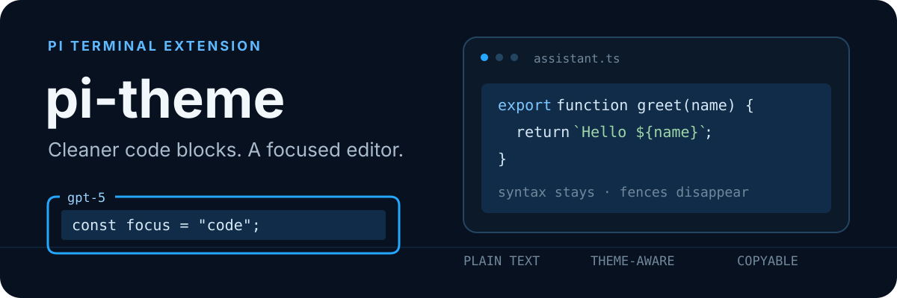

<p align="center">
  
</p>

# pi-theme

Personal Pi Theme — a small [Pi](https://pi.dev) extension that gives terminal output cleaner code blocks and the input editor a focused blue frame.

## What changes

### Fenceless code blocks

Fenced Markdown code renders without visible backtick fences. Syntax highlighting remains, and each line fills the available width with Pi's `toolPendingBg` theme color. Blockquotes keep italic/quote color but drop the `│` gutter, so a line select copies the text instead of the chrome.

### Boxed editor

The input editor gets a blue `╭─╮ │ ╰─╯` frame. Its top border shows the active model and a braille spinner while Pi works. Scroll hints move into the top and bottom borders.

## Install

Review the source first: Pi extensions run with your full system permissions.

```bash
pi install npm:@itc-steve/pi-theme
```

Restart Pi after installation. Local checkout:

```bash
pi install /path/to/pi-theme
```

## Development

Requirements: Node.js with TypeScript type stripping support and Pi's core packages available as peers.

```bash
npm test
```

The package has no runtime dependencies beyond Pi.

## License

[MIT](./LICENSE) © 2026 itc-steve
